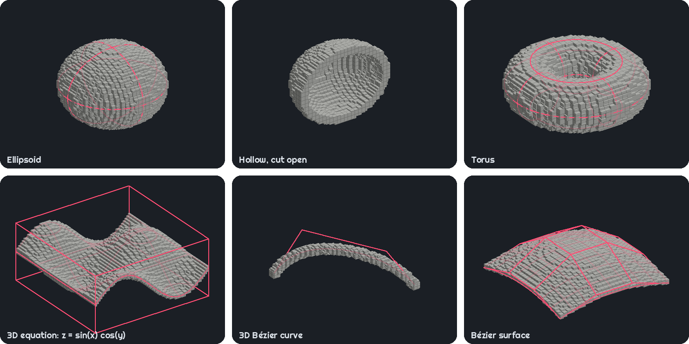
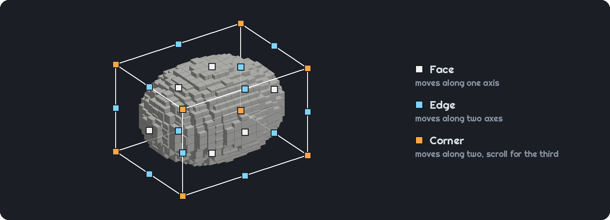

# Curve Generator


A Fabric and NeoForge mod for Minecraft Java 26.3 that turns shapes into blocks. In 2D it builds ellipses, equations and Bézier curves. In 3D it builds ellipsoids, toruses, equations in x, y and z, Bézier curves and Bézier surfaces. It picks full blocks, slabs, stairs, trapdoors, shelves, fences, glass panes and walls to match the shape as closely as possible. The shape appears in your world as a hologram that you resize and bend by dragging its handles. You can then place it or export it as a Litematica schematic.



## Install

Download the mod from [Modrinth](https://modrinth.com/mod/curvegen) or [CurseForge](https://www.curseforge.com/minecraft/mc-mods/curvegen) and put the jar in your `mods` folder. The Fabric jar also needs [Fabric API](https://modrinth.com/mod/fabric-api). [Mod Menu](https://modrinth.com/mod/modmenu) is optional and adds a way to the settings.

Version 2 is for Minecraft 26.3. Earlier versions, without the in-world editor and 3D shapes, exist for 1.21 to 1.21.11, 26.1 and 26.2, built from the `*/stable` branches.

## Quick tour

1. Hold **V** to open the radial menu. Point at **2D shapes** or **3D shapes** and let go, then click a shape. Its hologram appears at the block you're looking at.
2. Look at a handle on the hologram's box so it lights up, hold the left mouse button and look where it should go. Face handles move along one axis, edge handles along two, and corner handles in the plane facing you, with scrolling for the third axis. Hold sneak to move the opposite side too.
3. On a Bézier curve or surface, drag the control points the same way. Right-click removes a point, middle-click copies it, and **Insert** adds one where you look at the curve. On a surface these add and remove a whole row, or a column while you sneak.
4. Press **Page Up** and **Page Down** to move the shape away from you and back. **Home** and **End** push out and pull in the side you're facing. **R** rotates and **U** tips. Hold one of the move or resize keys for 3 seconds to type an exact number of blocks.
5. Open the radial menu again for **Shape options** and **Blocks**. Scroll over a wedge to change its value.
6. Press **Enter** to place the shape or **Backspace** to cancel. **Z** undoes an edit and **Y** redoes it. With no hologram out, **Z** undoes the last placement.



Press **G** for the full menu, with or without a hologram out. It has every setting for every shape, a preview you can turn for the 3D ones, and these tabs and buttons:

- **Blocks** chooses a block for each piece type. **Match a colour…** picks blocks whose textures are closest to a colour. Chains and end rods start switched off; press **Off** beside them to use them for thin lines.
- **Count** shows how many of each block you'll need.
- **Presets** saves a shape with its block choices.
- **Place** puts the shape in the world as a hologram, and **Export** saves a `.litematic` file.
- The cogwheel opens the settings: hold times, the radial menu, handle size, and the hologram's opacity and block limit.

Equations use Desmos-style syntax, like `y = 2sin(x)`, `x^2 + y^2 = 16` or `y < 9 - x^2/4`. A 3D equation can use x, y and z, where z is height, like `z = sin(x) cos(y)`.

Placing needs operator permissions, the same as `/setblock`. In singleplayer, that means cheats must be on. Editing and exporting work anywhere.

Right-click a button that steps through options to step backwards. You can rebind every key under Options → Controls → Key Binds → Curve Generator.

The [wiki](https://github.com/Neil-001/curvegen/wiki) covers the rest: Replace and Carve, presets, exporting, and how resource packs and modded blocks work.

## Development

You'll need JDK 25.

```
./gradlew build                 # builds both jars and runs the tests
./gradlew :fabric:runClient     # starts a Fabric dev client with the mod
./gradlew :neoforge:runClient   # starts a NeoForge dev client with the mod
```

On Windows, use `gradlew.bat`. The jars end up in `fabric/build/libs/` and `neoforge/build/libs/`. The Minecraft, Fabric and NeoForge versions are in `gradle.properties`.

- The shared code is in `src/`. `fabric/` and `neoforge/` each hold only that loader's entrypoints and metadata.
- `dev.curvegen.core` holds the shape maths, the 2D and 3D solvers and the editor's maths. It has no Minecraft imports, so nearly all the tests run without the game. Keep it that way.
- Run `./gradlew build` before pushing.

---

License: MIT.