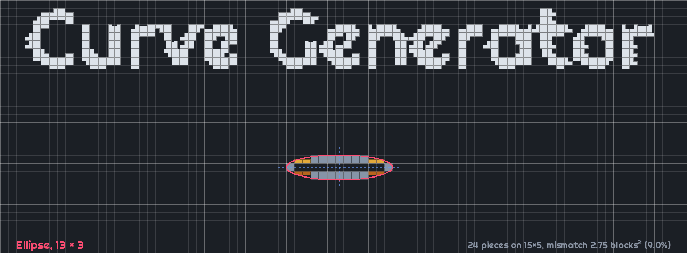

# Curve Generator



A Fabric and NeoForge mod for Minecraft Java 26.3 that turns ellipses, equations and Bézier curves into blocks. It picks full blocks, slabs, stairs, trapdoors, shelves, fences, glass panes and walls to match the curve as closely as possible. You can then place the result in your world or export it as a Litematica schematic.

## Install

Download the mod from [Modrinth](https://modrinth.com/mod/curvegen) or [CurseForge](https://www.curseforge.com/minecraft/mc-mods/curvegen). Put the jar in your `mods` folder along with [Fabric API](https://modrinth.com/mod/fabric-api). You'll need Fabric Loader. Jars exist for Minecraft 1.21 to 1.21.11, built from the `1.21.x/stable` branch. This branch targets 26.3, for Fabric and NeoForge, and has no release yet.

## Quick tour

1. Press **G** to open the generator.
2. Pick a tab: **Ellipse**, **Equation** or **Bézier**. Equations use Desmos-style syntax, like `y = 2sin(x)`, `x^2 + y^2 = 16` or `y < 9 - x^2/4`. On the Bézier tab, drag the numbered handles in the preview.
3. On the **Blocks** tab, choose a block for each piece type, or use **Match a colour…** to pick blocks whose textures are closest to a colour.
4. Choose **Upright** to build it like a wall or **Flat** to build it like a floor.
5. Check the **Count** tab to see how many of each block you'll need.
6. Press **Place** to position a hologram in the world, then press Enter to build it. Or press **Export** to save a `.litematic` file.

Placing needs operator permissions, the same as `/setblock`. In singleplayer, that means cheats must be on. Exporting works anywhere.

Right-click a button that steps through options to step backwards. You can rebind every key under Options → Controls → Key Binds → Curve Generator.

The [wiki](https://github.com/Neil-001/curvegen/wiki) covers the rest: placement keys, Replace and Carve, presets, exporting, and how resource packs and modded blocks work.

## Development

You'll need JDK 25.

```
./gradlew build                 # builds both jars and runs the tests
./gradlew :fabric:runClient     # starts a Fabric dev client with the mod
./gradlew :neoforge:runClient   # starts a NeoForge dev client with the mod
```

On Windows, use `gradlew.bat`. The jars end up in `fabric/build/libs/` and `neoforge/build/libs/`. The Minecraft, Fabric and NeoForge versions are in `gradle.properties`.

- The shared code is in `src/`. `fabric/` and `neoforge/` each hold only that loader's entrypoints and metadata.
- `dev.curvegen.core` holds the shape maths and the solver. It has no Minecraft imports, so the tests run without the game. Keep it that way.
- Run `./gradlew build` before pushing.

---

License: MIT.